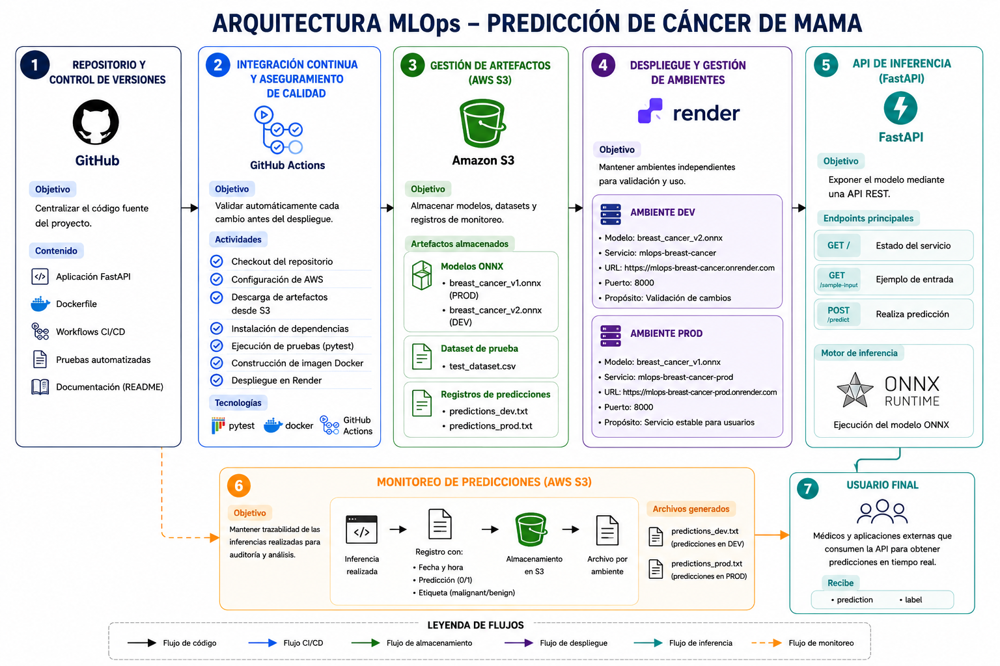

# Breast Cancer MLOps Platform

## Introducción

El despliegue de modelos de Machine Learning en entornos productivos requiere mecanismos que permitan automatizar pruebas, controlar versiones de modelos, separar ambientes de desarrollo y producción, y garantizar la disponibilidad de los artefactos necesarios para la inferencia.

Con el objetivo de abordar estos retos, se desarrolló una plataforma MLOps para la predicción de cáncer de mama utilizando modelos exportados en formato ONNX. La solución implementa un flujo automatizado que integra almacenamiento de modelos en AWS S3, pruebas automatizadas mediante GitHub Actions, contenerización con Docker y despliegue continuo utilizando Render.

La plataforma mantiene ambientes independientes para desarrollo (DEV) y producción (PROD), permitiendo validar nuevas versiones de modelos antes de promoverlas a producción. Adicionalmente, cada predicción realizada es registrada automáticamente en archivos de monitoreo almacenados en AWS S3, facilitando el seguimiento y análisis posterior del comportamiento del sistema.

La arquitectura implementada busca aplicar principios fundamentales de MLOps, incluyendo automatización, reproducibilidad, separación de ambientes, gestión centralizada de artefactos y monitoreo básico de inferencias.

---

# Objetivos

## Objetivo general

Diseñar e implementar una plataforma MLOps para el despliegue automatizado de modelos de clasificación de cáncer de mama utilizando FastAPI, Docker, GitHub Actions, AWS S3 y Render.

## Objetivos específicos

- Implementar una API de inferencia basada en FastAPI para consumir modelos ONNX.
- Almacenar modelos y datasets de prueba en AWS S3 evitando incluir artefactos pesados dentro del repositorio.
- Automatizar la descarga de modelos y datasets durante la ejecución de pruebas y despliegues.
- Implementar pruebas automáticas para validar el correcto funcionamiento del modelo.
- Construir imágenes Docker reproducibles para facilitar el despliegue de la aplicación.
- Configurar pipelines CI/CD mediante GitHub Actions.
- Mantener ambientes independientes de desarrollo (DEV) y producción (PROD).
- Registrar automáticamente las predicciones realizadas por los usuarios para facilitar tareas de monitoreo.
- Aplicar buenas prácticas de configuración y gestión de credenciales.

---

# Arquitectura de la solución

La solución desarrollada está compuesta por varios componentes que trabajan de forma integrada para soportar el ciclo de vida del modelo de Machine Learning, desde su almacenamiento hasta su consumo mediante una API desplegada en la nube.

El repositorio GitHub actúa como punto central de control de versiones y contiene el código fuente de la aplicación, los pipelines de integración continua y las pruebas automatizadas.

Los modelos ONNX y los datasets utilizados para validación no se almacenan dentro del repositorio. Estos artefactos se encuentran centralizados en AWS S3.

Cuando se realiza un cambio sobre alguna de las ramas principales, GitHub Actions ejecuta automáticamente el pipeline correspondiente. Durante este proceso se descargan los modelos y datasets necesarios, se ejecutan pruebas automatizadas y posteriormente se construye la imagen Docker.

La aplicación se despliega en Render utilizando FastAPI y ONNX Runtime para servir inferencias en línea.

Finalmente, cada predicción realizada es registrada automáticamente en AWS S3 para fines de monitoreo y trazabilidad.

## Diagrama de arquitectura



---

# Tecnologías utilizadas

La solución integra diferentes tecnologías que permiten automatizar el ciclo de vida del modelo, desde su almacenamiento hasta su despliegue y consumo mediante una API.

## Python

Python fue utilizado como lenguaje principal para el desarrollo de toda la solución. Su ecosistema permite integrar bibliotecas especializadas para Machine Learning, servicios en la nube, pruebas automatizadas y desarrollo de APIs.

Dentro del proyecto, Python se utiliza para:

- Carga y ejecución de modelos ONNX.
- Construcción de la API.
- Integración con AWS S3.
- Implementación de pruebas automatizadas.
- Gestión del flujo de inferencia.

## FastAPI

FastAPI es el framework utilizado para exponer el modelo mediante una API REST.

Fue seleccionado por:

- Alto rendimiento.
- Validación automática de datos.
- Generación automática de documentación Swagger.
- Facilidad para desplegar servicios de Machine Learning.

FastAPI constituye la capa de interacción entre el usuario y el modelo desplegado.

## ONNX Runtime

ONNX Runtime es el motor encargado de ejecutar los modelos de Machine Learning.

Su función principal es:

- Cargar modelos ONNX.
- Ejecutar inferencias.
- Retornar predicciones al servicio FastAPI.

La utilización de ONNX Runtime permite desacoplar completamente el proceso de entrenamiento del proceso de despliegue.

## Docker

Docker se utiliza para contenerizar la aplicación.

La imagen Docker incluye:

- Código fuente.
- Dependencias.
- Configuración necesaria para la ejecución.

Esto permite desplegar exactamente la misma aplicación en cualquier entorno compatible.

## GitHub

GitHub se utiliza como sistema de control de versiones y repositorio central del proyecto.

Además de almacenar el código, actúa como punto de integración para los pipelines CI/CD.

## GitHub Actions

GitHub Actions implementa los procesos de Integración Continua y Despliegue Continuo.

Cada cambio realizado sobre las ramas principales dispara automáticamente procesos de validación y construcción.

Gracias a esto se evita desplegar versiones que no hayan sido previamente verificadas.

## AWS S3

AWS S3 actúa como repositorio centralizado de artefactos.

Se utiliza para almacenar:

- Modelos ONNX.
- Dataset de pruebas.
- Registros históricos de predicciones.

Esta estrategia evita almacenar archivos pesados dentro del repositorio GitHub y facilita la gestión de versiones de modelos.

## Render

Render es la plataforma utilizada para desplegar la aplicación en la nube.

Se configuraron dos servicios independientes:

- DEV
- PROD

Esto permite mantener ambientes aislados y desplegar diferentes versiones del modelo de forma controlada.

## Pytest

Pytest se utiliza para automatizar la validación del sistema antes de cada despliegue.

Las pruebas verifican:

- Correcta ejecución de inferencias.
- Funcionamiento esperado del modelo.
- Cumplimiento de métricas mínimas definidas para el proyecto.

---

# Estructura del repositorio

```text
mlops-breast-cancer/

├── .github/
│   └── workflows/
│       ├── dev.yml
│       └── prod.yml
│
├── app/
│   ├── __init__.py
│   ├── inference.py
│   ├── main.py
│   ├── model_loader.py
│   ├── s3_utils.py
│   └── schemas.py
│
├── scripts/
│
├── tests/
│   ├── __init__.py
│   ├── test_accuracy.py
│   └── test_prediction.py
│
├── .dockerignore
├── .gitignore
├── Dockerfile
├── requirements.txt
└── README.md
```

## Carpeta `.github/workflows`

Contiene los pipelines CI/CD ejecutados por GitHub Actions.

### `dev.yml`

Pipeline asociado al ambiente DEV.

Responsabilidades:

- Configuración de credenciales AWS.
- Descarga de modelos desde S3.
- Descarga del dataset de prueba.
- Instalación de dependencias.
- Ejecución de pruebas automatizadas.
- Construcción de la imagen Docker.

### `prod.yml`

Pipeline asociado al ambiente PROD.

Ejecuta el mismo flujo de validación antes del despliegue en producción.

## Carpeta `app`

Contiene la lógica principal de la aplicación.

### `main.py`

Archivo principal de FastAPI.

Responsabilidades:

- Definir los endpoints de la API.
- Cargar el modelo correspondiente al ambiente.
- Gestionar solicitudes de inferencia.
- Registrar automáticamente las predicciones en AWS S3.

### `model_loader.py`

Encargado de:

- Descargar modelos desde AWS S3.
- Crear sesiones ONNX Runtime.
- Desacoplar el almacenamiento del modelo respecto al código fuente.

### `inference.py`

Implementa la lógica de inferencia.

Responsabilidades:

- Preparar los datos de entrada.
- Ejecutar inferencia mediante ONNX Runtime.
- Interpretar el resultado del modelo.
- Retornar la predicción y su etiqueta asociada.

### `s3_utils.py`

Centraliza las operaciones relacionadas con AWS S3.

Responsabilidades:

- Descargar modelos ONNX.
- Registrar predicciones en archivos TXT.
- Gestionar la interacción con el bucket.

### `schemas.py`

Define los esquemas de entrada y salida utilizados por FastAPI.

Permite:

- Validar solicitudes.
- Estandarizar respuestas.
- Generar documentación automática.

## Carpeta `tests`

Contiene las pruebas automatizadas utilizadas por los pipelines CI/CD.

### `test_prediction.py`

Valida que el modelo genere predicciones válidas para entradas conocidas.

### `test_accuracy.py`

Verifica que el modelo mantenga un nivel mínimo de desempeño utilizando el dataset de prueba.

## Dockerfile

Define la construcción de la imagen Docker utilizada para desplegar la aplicación.

## requirements.txt

Contiene todas las dependencias necesarias para ejecutar el proyecto.

---

# Gestión de modelos

Los modelos utilizados por la aplicación se almacenan en AWS S3 y son descargados dinámicamente cuando son requeridos por la API o por los pipelines de validación.

Actualmente el proyecto mantiene dos versiones independientes del modelo:

- breast_cancer_v1.onnx
- breast_cancer_v2.onnx

## Estrategia DEV y PROD

Uno de los principios fundamentales de MLOps consiste en separar ambientes de desarrollo y producción.

Para implementar este concepto, la solución utiliza dos ambientes completamente independientes:

| Ambiente | Modelo |
|-----------|-----------|
| DEV | breast_cancer_v2.onnx |
| PROD | breast_cancer_v1.onnx |

### Ambiente DEV

El ambiente DEV está destinado a validar nuevas versiones del modelo antes de su promoción a producción.

Actualmente utiliza:

```text
breast_cancer_v2.onnx
```

Este entorno permite:

- Probar cambios de código.
- Validar nuevas versiones del modelo.
- Ejecutar pruebas sin afectar usuarios finales.

### Ambiente PROD

El ambiente PROD representa la versión estable de la solución.

Actualmente utiliza:

```text
breast_cancer_v1.onnx
```

Este entorno recibe únicamente versiones previamente verificadas.

### Selección dinámica del modelo

La aplicación no tiene el nombre del modelo escrito de forma fija dentro del código.

La selección se realiza mediante configuración externa.

Cuando la aplicación inicia:

1. Identifica el ambiente activo.
2. Obtiene el nombre del modelo configurado.
3. Descarga el modelo desde AWS S3.
4. Crea la sesión ONNX Runtime.
5. Habilita el servicio de inferencia.

### Beneficios de esta estrategia

- Separación entre desarrollo y producción.
- Menor riesgo durante actualizaciones.
- Mayor control sobre versiones de modelos.
- Posibilidad de validar nuevas versiones antes de promoverlas.
- Alineación con prácticas reales de MLOps.

---

# Pipeline CI/CD

La automatización de validaciones y despliegues fue implementada mediante GitHub Actions.

El objetivo principal del pipeline es garantizar que cualquier cambio realizado en el proyecto sea validado antes de ser desplegado.

## Flujo general

Cada vez que se realiza un push sobre una de las ramas principales:

```text
DEV
PROD
```

## Flujo DEV

1. Push a la rama DEV.
2. Descarga de modelos desde AWS S3.
3. Descarga del dataset de prueba.
4. Instalación de dependencias.
5. Ejecución de pruebas automatizadas.
6. Construcción de imagen Docker.
7. Despliegue del servicio DEV.

## Flujo PROD

1. Push a la rama PROD.
2. Descarga de modelos desde AWS S3.
3. Descarga del dataset de prueba.
4. Instalación de dependencias.
5. Ejecución de pruebas automatizadas.
6. Construcción de imagen Docker.
7. Despliegue del servicio PROD.

GitHub Actions ejecuta automáticamente el pipeline correspondiente.

## Etapa 1: Obtención del código

El pipeline descarga la versión más reciente del repositorio para garantizar que todas las validaciones se realicen sobre el estado actual del proyecto.

## Etapa 2: Configuración de acceso a AWS

Se configuran las credenciales necesarias para acceder a los recursos almacenados en AWS S3.

Esto permite acceder de forma segura a:

- Modelos ONNX.
- Dataset de prueba.
- Archivos utilizados durante la validación.

## Etapa 3: Descarga de artefactos

Los modelos y datasets requeridos son descargados desde AWS S3.

Este paso garantiza que el pipeline utilice exactamente los mismos artefactos que utiliza la aplicación desplegada.

## Etapa 4: Instalación de dependencias

Se instalan todas las librerías definidas en:

```text
requirements.txt
```

De esta forma el entorno de validación replica el entorno utilizado por la aplicación.

## Etapa 5: Ejecución de pruebas

Se ejecutan las pruebas automatizadas definidas dentro de la carpeta:

```text
tests/
```

Estas pruebas validan:

- Correcta ejecución del modelo.
- Generación de predicciones válidas.
- Cumplimiento de métricas mínimas.

## Etapa 6: Construcción de imagen Docker

Una vez superadas las validaciones, se construye la imagen Docker de la aplicación.

Esto garantiza que el despliegue utilice una versión reproducible y consistente del sistema.

## Etapa 7: Despliegue

Finalmente se actualiza el servicio correspondiente:

- DEV
- PROD

dependiendo de la rama que originó la ejecución.

## Beneficios del pipeline implementado

- Automatización de validaciones.
- Reducción de errores manuales.
- Despliegues reproducibles.
- Validación continua del modelo.
- Integración entre GitHub, AWS y Render.

---

# Aplicación de inferencia y API

La interacción entre los usuarios y el modelo de Machine Learning se realiza mediante una API desarrollada con FastAPI.

La API constituye la capa de servicio de la solución y permite consumir el modelo desplegado a través de solicitudes HTTP. De esta forma, cualquier aplicación externa puede utilizar el modelo sin necesidad de conocer detalles internos relacionados con almacenamiento, carga de modelos o ejecución de inferencias.

Cuando la aplicación inicia, se ejecuta el proceso de carga del modelo correspondiente al ambiente configurado. Si el modelo no se encuentra disponible localmente, este es descargado automáticamente desde AWS S3 y posteriormente cargado mediante ONNX Runtime.

Una vez completada la carga del modelo, la API queda disponible para recibir solicitudes de inferencia.

## Flujo completo de inferencia

Cada vez que un usuario realiza una solicitud al endpoint de predicción ocurre el siguiente proceso:

1. El usuario envía una solicitud HTTP al endpoint `/predict`.
2. FastAPI valida automáticamente la estructura de los datos recibidos.
3. La solicitud es transformada al esquema interno definido por la aplicación.
4. Los datos son enviados al motor de inferencia ONNX Runtime.
5. El modelo genera una predicción.
6. La aplicación interpreta el resultado numérico.
7. Se construye la respuesta para el usuario.
8. Se registra la predicción en AWS S3.
9. La respuesta es enviada al cliente.

Este flujo garantiza que todas las inferencias utilicen exactamente la misma versión del modelo configurada para el ambiente correspondiente.

## Endpoint raíz

```http
GET /
```

Este endpoint permite verificar el estado general del servicio.

La respuesta incluye información básica sobre la aplicación y la versión del modelo cargado.

Su principal utilidad es validar que la API se encuentra operativa y que el modelo fue cargado correctamente.

## Endpoint de ejemplo

```http
GET /sample-input
```

Retorna un conjunto de características válido para realizar pruebas rápidas sobre la API.

Este endpoint facilita la exploración del servicio y reduce la probabilidad de errores al construir solicitudes manuales.

## Endpoint de predicción

```http
POST /predict
```

Es el endpoint principal de la aplicación.

Recibe un conjunto de variables numéricas asociadas a un paciente y ejecuta una inferencia utilizando el modelo ONNX cargado.

La respuesta contiene:

- prediction
- label

## Interpretación de resultados

El modelo realiza una clasificación binaria asociada al diagnóstico de cáncer de mama.

| Predicción | Etiqueta |
|------------|------------|
| 0 | malignant |
| 1 | benign |

Donde:

- **malignant** indica la presencia de un tumor maligno.
- **benign** indica la presencia de un tumor benigno.

La API retorna tanto el valor numérico como la etiqueta correspondiente para facilitar la interpretación de los resultados.

## Documentación interactiva

FastAPI genera automáticamente documentación Swagger para todos los endpoints definidos.

Esta documentación permite:

- Explorar la API.
- Probar solicitudes desde el navegador.
- Visualizar esquemas de entrada y salida.
- Facilitar las tareas de validación y demostración durante el desarrollo y la sustentación.

La documentación se encuentra disponible en:

```text
/docs
```

---

# FastAPI

FastAPI es el framework principal utilizado para construir la capa de servicio de la solución.

Su función consiste en exponer el modelo de Machine Learning mediante una interfaz REST que permita a usuarios y aplicaciones externas realizar inferencias de manera sencilla y estandarizada.

La elección de FastAPI se realizó por varias razones:

- Alto rendimiento.
- Bajo consumo de recursos.
- Validación automática de datos.
- Generación automática de documentación.
- Facilidad de integración con modelos de Machine Learning.

Uno de los beneficios más importantes dentro de este proyecto es la validación automática de solicitudes.

Antes de ejecutar una inferencia, FastAPI verifica que la estructura de los datos recibidos coincida con los esquemas definidos por la aplicación.

Esto reduce errores de ejecución y mejora la robustez del servicio.

Adicionalmente, FastAPI genera automáticamente documentación interactiva basada en Swagger UI, permitiendo explorar y probar todos los endpoints sin necesidad de herramientas externas.

Dentro de la arquitectura implementada, FastAPI actúa como la capa de comunicación entre:

- Usuario.
- Modelo ONNX.
- Sistema de monitoreo de predicciones.

De esta forma se convierte en el componente central encargado de coordinar el flujo completo de inferencia.

---

# Monitoreo de predicciones

Además del servicio de inferencia, la solución incorpora un mecanismo de monitoreo básico basado en el registro persistente de todas las predicciones realizadas por los usuarios.

Este componente fue implementado para cumplir el requisito de conservar un historial de inferencias que pueda ser utilizado posteriormente para auditoría, análisis o monitoreo del comportamiento del sistema.

## Objetivo del monitoreo

El propósito principal de este mecanismo es mantener trazabilidad sobre las predicciones realizadas por la aplicación.

Aunque la solución no implementa herramientas avanzadas de observabilidad o monitoreo de modelos, el registro persistente de inferencias constituye una base importante para futuras extensiones de MLOps.

## Almacenamiento de registros

Los registros se almacenan en AWS S3 dentro de una ubicación independiente a la utilizada para modelos y datasets.

La solución mantiene dos archivos separados:

```text
predictions_dev.txt
predictions_prod.txt
```

Cada ambiente registra sus predicciones de forma independiente.

Esta separación permite evitar la mezcla de información proveniente de desarrollo y producción.

## Flujo de registro

Cada vez que un usuario realiza una inferencia mediante el endpoint `/predict`, ocurre el siguiente proceso:

1. FastAPI recibe la solicitud.
2. ONNX Runtime ejecuta la inferencia.
3. Se obtiene el resultado numérico de la predicción.
4. La aplicación determina la etiqueta asociada.
5. Se identifica el ambiente activo.
6. Se selecciona el archivo correspondiente.
7. Se agrega una nueva línea al archivo de monitoreo.
8. El archivo actualizado se almacena nuevamente en AWS S3.

Todo este proceso ocurre automáticamente y no requiere intervención del usuario.

## Información registrada

Por cada inferencia se almacena:

- Fecha y hora de ejecución.
- Valor numérico de la predicción.
- Etiqueta asociada.

Ejemplo:

```text
2026-06-14 22:47:39,prediction=0,label=malignant
```

## Beneficios de la estrategia implementada

La estrategia utilizada proporciona varias ventajas:

- Persistencia de registros.
- Trazabilidad de inferencias.
- Separación entre DEV y PROD.
- Almacenamiento centralizado.
- Facilidad de auditoría.

Además, esta información podría utilizarse posteriormente para construir mecanismos más avanzados de monitoreo, análisis de uso o evaluación continua del comportamiento del modelo.

## Relación con MLOps

En proyectos MLOps reales, el monitoreo constituye una etapa fundamental del ciclo de vida del modelo.

Aunque la solución implementada utiliza un mecanismo sencillo basado en archivos TXT almacenados en AWS S3, el enfoque sigue el mismo principio fundamental: conservar evidencia de las inferencias realizadas para facilitar tareas de seguimiento, análisis y mejora continua.

---

# Configuración y seguridad

La configuración necesaria para la ejecución de la aplicación se gestiona mediante mecanismos externos proporcionados por las plataformas utilizadas durante el despliegue.

Las credenciales de acceso a recursos en la nube no forman parte del repositorio y son administradas de forma independiente.

La solución mantiene una separación clara entre ambientes DEV y PROD, permitiendo administrar configuraciones específicas para cada entorno sin modificar el código fuente.

---

# Despliegue y acceso a la aplicación

La solución se encuentra desplegada en la nube mediante Render y cuenta con dos ambientes independientes.

## Ambiente DEV

La documentación interactiva del servicio se encuentra disponible en:

```text
https://mlops-breast-cancer.onrender.com/docs
```

Este ambiente utiliza la versión más reciente del modelo para validar cambios antes de promoverlos a producción.

## Ambiente PROD

La documentación interactiva del servicio se encuentra disponible en:

```text
https://mlops-breast-cancer-prod.onrender.com/docs
```

Este ambiente utiliza la versión estable del modelo.

## Pruebas

Las pruebas automatizadas del proyecto pueden ejecutarse mediante:

```bash
pytest
```

Estas pruebas son utilizadas por los pipelines CI/CD para validar el correcto funcionamiento del sistema antes de cada despliegue.

---

# Conclusiones

En este proyecto se desarrolló una plataforma MLOps orientada al despliegue automatizado de modelos de Machine Learning utilizando tecnologías ampliamente utilizadas en entornos productivos.

La solución permite desacoplar los modelos del código fuente mediante almacenamiento externo, automatizar procesos de validación utilizando GitHub Actions y desplegar servicios de inferencia mediante contenedores Docker.

La arquitectura implementada incorpora ambientes independientes para desarrollo y producción, facilitando la validación controlada de nuevas versiones antes de su promoción a producción.

Adicionalmente, se implementó un mecanismo de monitoreo basado en el registro persistente de predicciones, permitiendo conservar evidencia de las inferencias realizadas y sentando las bases para futuras estrategias de observabilidad.

Finalmente, el proyecto demuestra la integración práctica de conceptos fundamentales de MLOps, incluyendo automatización, gestión de artefactos, pruebas continuas, despliegue continuo, separación de ambientes y monitoreo de inferencias.